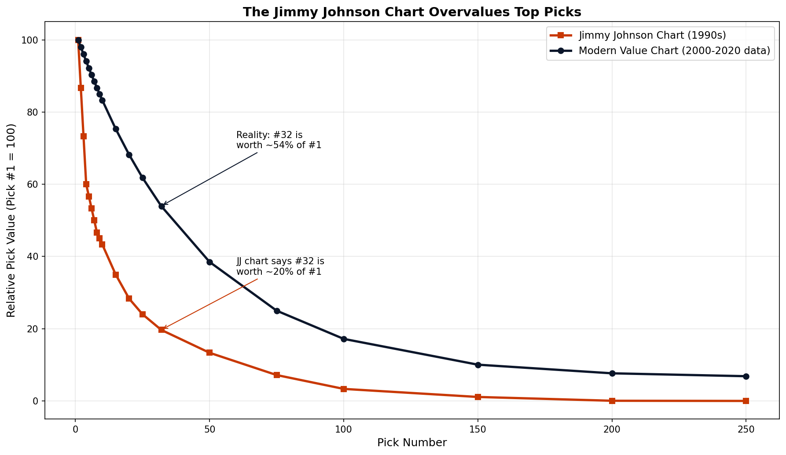
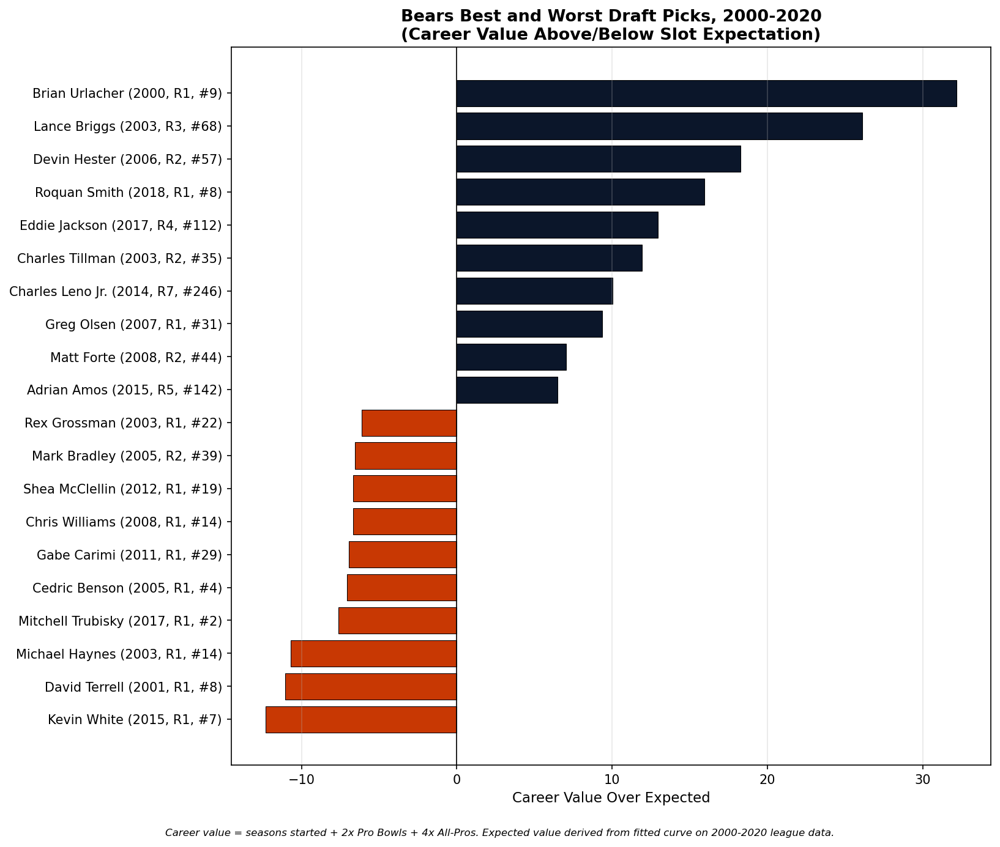
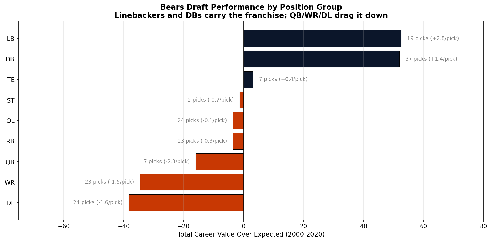

# Modern NFL Draft Value Chart & Chicago Bears Audit

A data-driven critique of the Jimmy Johnson draft value chart, applied to 21 years of Chicago Bears draft history.

## TL;DR

Built a modern draft pick value curve from 5,350 NFL draft picks (2000-2020) using career outcomes — seasons started, Pro Bowls, and All-Pro selections. Compared the resulting curve to the Jimmy Johnson chart that still anchors NFL trade discussions, then applied it to audit every Chicago Bears pick across the era.

**Three findings:**

1. **The Jimmy Johnson chart overvalues top picks by roughly 2.7x.** Pick #1 is worth ~1.85x pick #32 in actual career outcomes, not 5.08x as the JJ chart implies. This has direct implications for trade-up decisions and pick-for-pick swaps.

2. **The Bears have drafted slightly above league average (+10.2 cumulative VOE, 15th of 32 teams).** Hits like Urlacher, Briggs, Roquan Smith, Eddie Jackson, and Charles Tillman offset the high-profile misses.

3. **The Bears' draft DNA is strongly positional.** Linebackers and defensive backs have outperformed slot expectation by a combined +104 career value, while quarterbacks, wide receivers, and high-round defensive linemen have collectively cost the franchise -89.

## The Modern Value Chart vs Jimmy Johnson

The Jimmy Johnson chart, built in the early 1990s based on intuition and trade norms of the era, severely overvalues top picks. Using actual career outcomes from 21 NFL drafts, expected pick value decays much more gently:

| Picks Compared | Jimmy Johnson Ratio | Modern Data Ratio |
|---|---|---|
| #1 vs #32 | 5.08x | 1.85x |
| #1 vs #50 | 7.89x | 2.60x |
| #32 vs #100 | 6.92x | 3.14x |

Practical implication: a team trading up from pick 32 to pick 1 using the JJ chart is overpaying by roughly 2.7x what the data suggests the upgrade is actually worth.

## The Bears Audit

### Hits and Misses

The 10 worst Bears picks of the era are all Round 1 or Round 2 selections. The 10 best are spread across all seven rounds — Lance Briggs in R3, Eddie Jackson in R4, Adrian Amos in R5, and Charles Leno Jr. in R7 are all among the franchise's most valuable picks.

Brian Urlacher, taken #9 overall in 2000, returned the highest value-over-expected of any pick (+32). Kevin White at #7 in 2015 returned the worst (-12).

### Position Group Breakdown

The Bears' positive aggregate VOE comes entirely from LB (+52, 2.8/pick) and DB (+52, 1.4/pick). Every other position group is at or below replacement level. Notably:

- **WR -34.5 across 23 picks** — a sustained, two-decade pattern of poor wide receiver evaluation. The Bears' WR average of -1.5 per pick is roughly 3x worse than the league average of -0.5.
- **DL -38.4 across 24 picks** — concentrated in early rounds. Of 8 Bears DL picks taken in rounds 1-2, only Tommie Harris and Eddie Goldman returned meaningful value.
- **QB -16 across 7 picks** — driven by Trubisky and Grossman.

### GM Era Breakdown

| GM | Drafts | Picks | Total VOE | VOE per Pick |
|---|---|---|---|---|
| Jerry Angelo (2001-2011) | 11 | 88 | -20.06 | -0.23 |
| Phil Emery (2012-2014) | 3 | 20 | -6.94 | -0.35 |
| Ryan Pace (2015-2020) | 6 | 39 | +4.42 | +0.11 |

Pace is the only GM with positive draft VOE in the window, despite the high-profile Round 1 misses (Trubisky, Kevin White). His Day 2 and Day 3 hits — Eddie Jackson at #112, Adrian Amos at #142, Cody Whitehair, Bilal Nichols at #145, Tarik Cohen at #119 — outweighed the Round 1 disasters in raw VOE terms. A leverage-weighted metric (one that weights premium picks more heavily) would likely flip this ranking.

## Methodology

**Data source:** `nfl_data_py` package, drawing from nflverse public data.

**Career value metric:** `seasons_started + 2 × Pro Bowls + 4 × All-Pros`. Position-agnostic to allow direct comparison across positions; weights are a judgment call but produce a top-20 leaderboard (Brady, Donald, Wagner, Zack Martin, Joe Thomas, Rodgers, Trent Williams) that aligns with consensus on the era's best players.

**Value curve:** Exponential decay function `value = a · exp(-b · pick) + c`, fit via `scipy.optimize.curve_fit` to mean career value at each pick slot. Fitted parameters: a=13.30, b=0.0219, c=0.90.

**Cutoff:** Drafts through 2020 only. Players need 4-5 NFL seasons to accumulate meaningful career value; including more recent classes would systematically penalize them.

## Limitations and Caveats

- **The metric undervalues special teams contributors.** Devin Hester, a Hall of Fame returner, registers as a +18 in our metric — high but understated. A complete metric would incorporate punt/kick return value.
- **Pro Bowl selection is partly a popularity contest.** Voting reflects narrative as much as performance. Future iterations could use PFF grades or DVOA-based metrics, though those are paywalled.
- **Aggregate VOE rewards volume.** A GM with many picks accumulating small wins will outscore one with fewer picks and bigger swings, even if the latter is strictly better at evaluation.
- **Career value is path-dependent.** A Round 1 bust occupies a roster spot a Round 4 hit had to earn. Coaches play their high picks longer, which may inflate `seasons_started` for early picks regardless of performance.

## Repository Contents

- `bears_draft_analysis.ipynb` — full analysis notebook
- `jj_vs_modern.png`, `bears_hits_misses.png`, `bears_by_position.png` — output charts

## Author

S. Z. — built as a portfolio project for football analytics roles.
